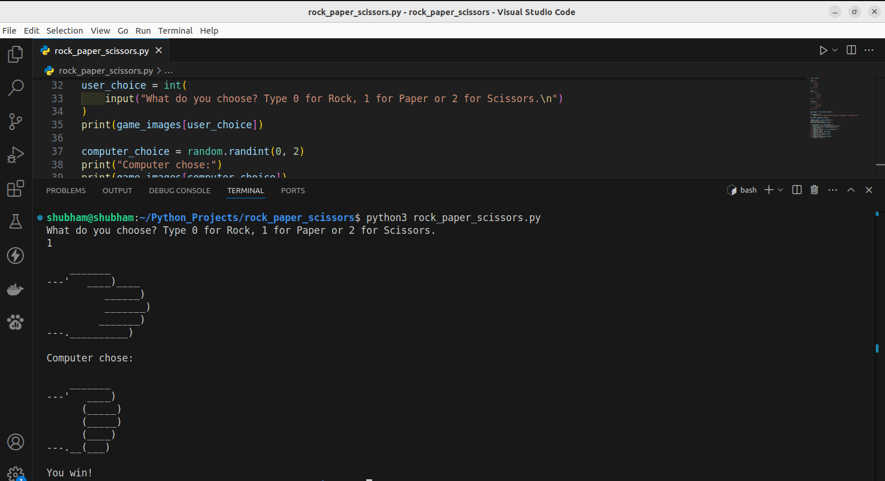

# Rock Paper Scissors

## Screenshot

This project is a Rock Paper Scissors game built with [Python 3](https://www.python.org/downloads), allowing a player to compete against the computer. The player selects rock, paper, or scissors, and the computer makes a random choice. The program then determines the winner based on the traditional game rules and displays the result. It’s a fun way to practice Python skills like user input, conditional statements, and randomization, with opportunities to expand by adding a scoring system or multiple rounds.

### To be Played with a Computer.

+ `You can enter the number of games you want to play.`
+ `There is also a score window which is displayed after every turn.`

## 🌟 How to run

+ `python3 rock_paper_scissors.py`